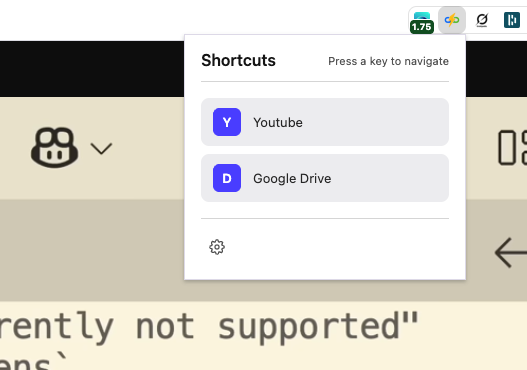
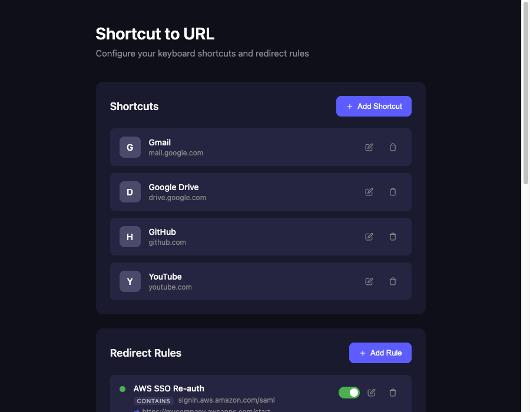
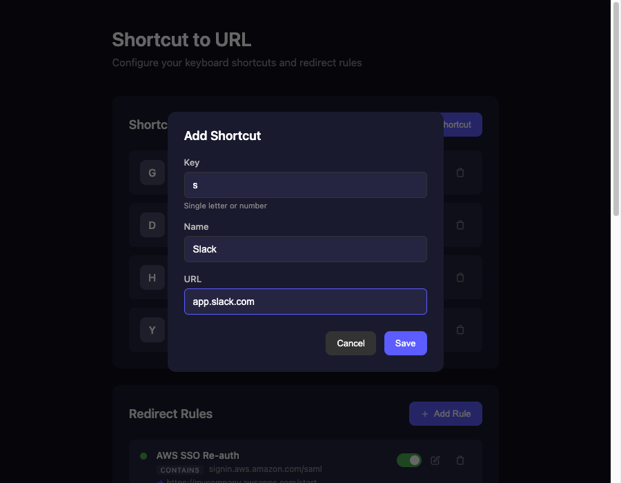
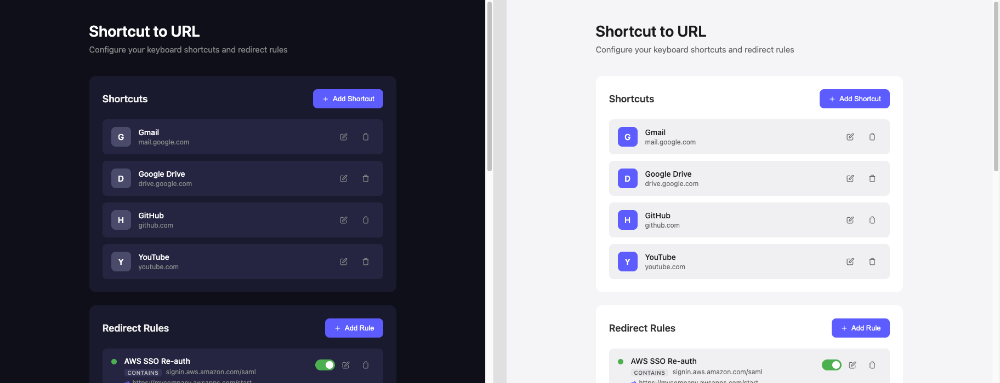

# Shortcut to URL

A Chrome extension that lets you navigate to your favorite websites using quick keyboard shortcuts. Press a hotkey to open the popup, then press a single key to instantly open the URL in a new tab. Also, works on all Chromium browsers.

## How It Works

1. Press `Cmd + .` (Mac) or `Ctrl + .` (Windows/Linux) to open the extension popup
2. The popup displays all your configured shortcuts
3. Press a single key (e.g., `g` for Gmail) to open that URL in a new tab
4. The new tab becomes active immediately

## Screenshots

<!-- Screenshot: Popup showing list of shortcuts -->


*The popup displays all configured shortcuts. Press any key to navigate.*

<!-- Screenshot: Options page with shortcuts list -->

*Manage your shortcuts from the options page.*

<!-- Screenshot: Add/Edit shortcut modal -->

*Add a new shortcut by specifying a key, name, and URL.*

<!-- Screenshot: Theme toggle showing light and dark modes side by side -->

*Choose between light and dark themes.*

## Installation

1. Clone or download this repository
2. Open Chrome and navigate to `chrome://extensions/`
3. Enable **Developer mode** (toggle in top right)
4. Click **Load unpacked**
5. Select the `shortcut_chrome_ext` folder

## Usage

### Adding Shortcuts

1. Click the extension icon or press `Cmd + .` / `Ctrl + .`
2. Click the gear icon to open settings
3. Click **Add Shortcut**
4. Enter:
   - **Key**: A single letter or number (e.g., `g`)
   - **Name**: A friendly name (e.g., `Gmail`)
   - **URL**: The destination URL (e.g., `gmail.com`)
5. Click **Save**

### Navigating

1. Press `Cmd + .` (Mac) or `Ctrl + .` (Windows/Linux)
2. Press the configured key to open the URL in a new tab
3. Alternatively, click on any shortcut in the popup

### Changing Theme

1. Open the options page (gear icon in popup)
2. Scroll to the **Appearance** section
3. Click **Light** or **Dark** to switch themes

## Features

- Quick two-step navigation (activation + single key)
- Opens URLs in new tabs (becomes active tab)
- Syncs shortcuts across Chrome browsers
- Light and dark theme support
- Clean, minimal interface

## File Structure

```
shortcut_chrome_ext/
├── manifest.json     # Extension configuration
├── popup.html        # Popup UI
├── popup.js          # Popup logic
├── popup.css         # Popup styles
├── options.html      # Settings page
├── options.js        # Settings logic
├── options.css       # Settings styles
└── README.md         # This file
```

## Keyboard Shortcuts

| Shortcut | Action |
|----------|--------|
| `Cmd + .` / `Ctrl + .` | Open extension popup |
| Any configured key | Navigate to URL |
| `Escape` | Close popup |

## License

MIT
