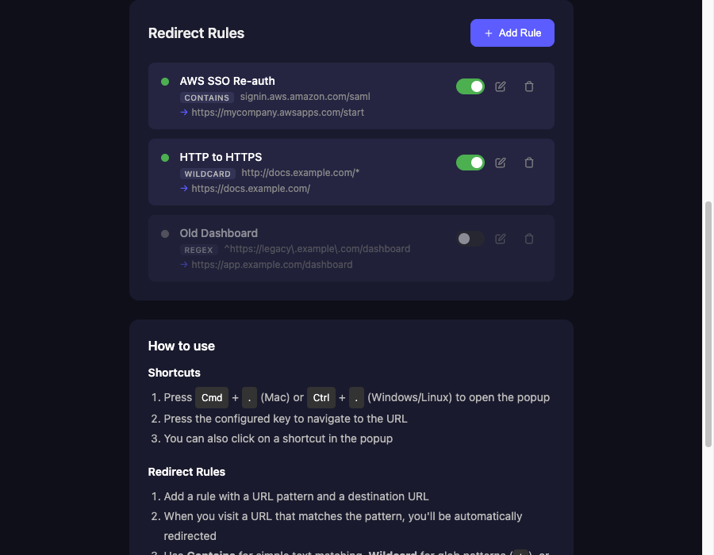
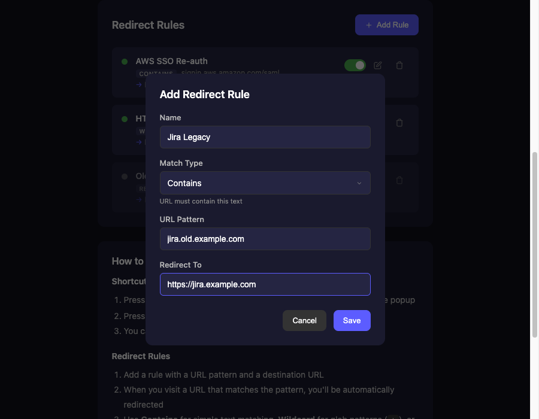

# Shortcut to URL

A Chrome extension that lets you navigate to your favorite websites using quick keyboard shortcuts, and automatically redirect URLs based on configurable rules. Press a hotkey to open the popup, then press a single key to instantly open the URL in a new tab. Works on all Chromium browsers.

## Features

- **Keyboard shortcuts**: Two-step navigation — activation hotkey + single key press
- **URL redirect rules**: Automatically redirect URLs matching a pattern to a different destination
  - Match types: Contains, Wildcard, and Regex
  - Toggle rules on/off without deleting them
  - Built-in loop prevention with cooldown
- Opens URLs in new active tabs
- Syncs shortcuts and rules across browsers via Chrome Storage
- Light and dark theme support
- Clean, minimal interface

## How It Works

### Shortcuts

1. Press `Cmd + .` (Mac) or `Ctrl + .` (Windows/Linux) to open the extension popup
2. Press a single key (e.g., `g` for Gmail) to open that URL in a new tab
3. You can also click on a shortcut in the popup

### Redirect Rules

1. Add a rule with a URL pattern and a destination URL in the settings page
2. When you visit a URL that matches the pattern, you'll be automatically redirected
3. Supports three match types:
   - **Contains**: Simple text matching (URL contains the pattern)
   - **Wildcard**: Glob patterns using `*` (e.g., `https://*.example.com/*`)
   - **Regex**: Full regular expressions (e.g., `^https://.*\.example\.com/`)
4. Toggle rules on/off without deleting them

## Screenshots

<!-- Screenshot: Popup showing list of shortcuts -->


*The popup displays all configured shortcuts. Press any key to navigate.*

<!-- Screenshot: Options page with shortcuts list -->

*Manage your shortcuts from the options page.*

<!-- Screenshot: Options page with redirect rules -->

*Configure URL redirect rules with Contains, Wildcard, or Regex matching.*

<!-- Screenshot: Add/Edit shortcut modal -->

*Add a new shortcut by specifying a key, name, and URL.*

<!-- Screenshot: Add/Edit redirect rule modal -->

*Add a redirect rule with a URL pattern and destination.*

<!-- Screenshot: Theme toggle showing light and dark modes side by side -->

*Choose between light and dark themes.*

## Installation

1. Clone or download this repository
2. Open Chrome and navigate to `chrome://extensions/`
3. Enable **Developer mode** (toggle in top right)
4. Click **Load unpacked**
5. Select the `shortcut_chrome_ext` folder

## Usage

### Adding Shortcuts

1. Click the extension icon or press `Cmd + .` / `Ctrl + .`
2. Click the gear icon to open settings
3. Click **Add Shortcut**
4. Enter:
   - **Key**: A single letter or number (e.g., `g`)
   - **Name**: A friendly name (e.g., `Gmail`)
   - **URL**: The destination URL (e.g., `gmail.com`)
5. Click **Save**

### Adding Redirect Rules

1. Open the settings page (gear icon in popup)
2. Scroll to the **Redirect Rules** section
3. Click **Add Rule**
4. Enter:
   - **Name**: A friendly name (e.g., `AWS SSO Re-auth`)
   - **Match Type**: Contains, Wildcard, or Regex
   - **URL Pattern**: The pattern to match against visited URLs
   - **Redirect To**: The destination URL
5. Click **Save**

### Changing Theme

1. Open the options page (gear icon in popup)
2. Scroll to the **Appearance** section
3. Click **Light** or **Dark** to switch themes

## Keyboard Shortcuts

| Shortcut | Action |
|----------|--------|
| `Cmd + .` / `Ctrl + .` | Open extension popup |
| Any configured key | Navigate to URL |
| `Escape` | Close popup |

## File Structure

```
shortcut_chrome_ext/
├── manifest.json     # Extension configuration (v3)
├── background.js     # Service worker for URL redirect rules
├── popup.html        # Popup UI
├── popup.js          # Popup logic & keyboard handling
├── popup.css         # Popup styles
├── options.html      # Settings page (shortcuts + redirects)
├── options.js        # Settings logic
├── options.css       # Settings styles
├── icon*.png         # Extension icons
└── README.md         # This file
```

## Troubleshooting

### Microsoft Edge: `Cmd + .` / `Ctrl + .` not working

Edge's built-in features (e.g., Copilot) may intercept the shortcut and prevent it from reaching the extension. To fix this:

1. Go to `edge://extensions/shortcuts`
2. Click the pencil icon next to the shortcut for **Shortcut to URL**
3. Re-enter `Cmd + .` (Mac) or `Ctrl + .` (Windows/Linux)

Manually setting the shortcut gives it higher priority over Edge's built-in bindings.

## License

MIT
